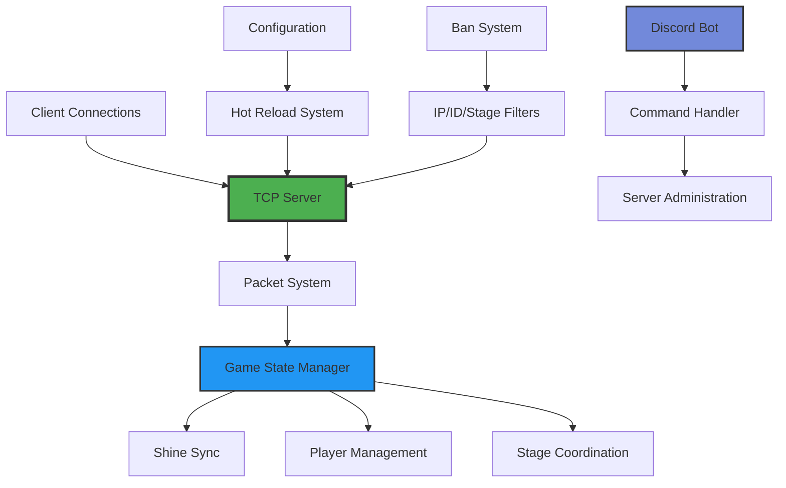

<div align="center">


# SmoOnlineServer

**A high-performance, feature-rich multiplayer server for Super Mario Odyssey Online**

[](https://dotnet.microsoft.com/)
[](https://hub.docker.com/)
[](LICENSE)
[](https://github.com/LeGeRyChEeSe/SmoOnlineServer/actions)

[](https://github.com/LeGeRyChEeSe/SmoOnlineServer/stargazers)
[](https://github.com/LeGeRyChEeSe/SmoOnlineServer/network)
[](https://github.com/LeGeRyChEeSe/SmoOnlineServer/issues)

---

*Transform your Super Mario Odyssey experience into a collaborative multiplayer adventure*

</div>

## Key Features

<table>
<tr>
<td>

### **Multiplayer Core**
- Real-time TCP networking
- Up to 8 concurrent players
- Auto-reconnection handling
- Cross-platform compatibility

</td>
<td>

### **Game Synchronization**
- Shared moon/shine collection
- Player costume sync
- Stage transition management
- Persistent game state

</td>
</tr>
<tr>
<td>

### **Administration**
- 70+ console commands
- Discord bot integration
- Advanced ban system
- Hot configuration reload

</td>
<td>

### **Game Modes**
- Hide and Seek
- Sardines mode
- Player flipping effects
- Custom scenarios

</td>
</tr>
</table>

## Architecture Overview



## Quick Start

### Docker Deployment (Recommended)

```bash
# Clone and start with single command
git clone https://github.com/LeGeRyChEeSe/SmoOnlineServer
cd SmoOnlineServer
docker-compose up -d

# Monitor logs
docker-compose logs --tail=20 --follow
```

### Pre-built Binary

| Platform | Download | Command |
|----------|----------|---------|
| **Windows** | [Latest Release](https://github.com/LeGeRyChEeSe/SmoOnlineServer/releases) | `./Server.exe` |
| **Linux** | [Latest Release](https://github.com/LeGeRyChEeSe/SmoOnlineServer/releases) | `./Server` |
| **macOS** | [Latest Release](https://github.com/LeGeRyChEeSe/SmoOnlineServer/releases) | `./Server` |

### Build from Source

```bash
# Prerequisites: .NET 8.0 SDK
git clone https://github.com/LeGeRyChEeSe/SmoOnlineServer
cd SmoOnlineServer

# Development build
dotnet build

# Production build
dotnet build -c Release

# Run server
dotnet run --project Server/Server.csproj
```

### Makefile (Simplified Commands)

A Makefile is included to simplify common development tasks:

```bash
# Build and run commands
make build          # Build in Debug mode
make build-release  # Build in Release mode  
make run            # Run server in Debug mode
make run-release    # Run server in Release mode
make dev            # Full development workflow (restore + build + run)

# Package management
make restore        # Restore NuGet packages
make clean          # Clean build artifacts
make rebuild        # Clean + restore + build

# Testing
make test-client SERVER_IP=127.0.0.1  # Run test client

# Docker commands  
make docker-build   # Build Docker images for all architectures
make docker-up      # Start containers in detached mode
make docker-down    # Stop and remove containers
make docker-logs    # View container logs with follow
make docker-restart # Restart containers
make docker-exec    # Execute shell in running container

# Show all available commands
make help
```

## Configuration

### Core Settings

| Setting | Default | Description |
|---------|---------|-------------|
| `Server.Port` | `1027` | Server listening port |
| `Server.MaxPlayers` | `8` | Maximum concurrent players |
| `Shines.Enabled` | `true` | Moon synchronization |
| `BanList.Enabled` | `false` | Ban system activation |
| `Discord.UseModernBot` | `true` | Discord.Net slash commands |

### Discord Integration

<details>
<summary><b>Discord Bot Setup</b></summary>

1. **Create Discord Application**
   ```
   https://discord.com/developers/applications
   ```

2. **Configure Bot Token**
   ```json
   {
     "discord": {
       "token": "YOUR_BOT_TOKEN",
       "useModernBot": true,
       "useLegacyBot": false,
       "testGuildId": "YOUR_GUILD_ID"
     }
   }
   ```

3. **Available Slash Commands**
   
   **Server Management:**
   - `/status` - Show server status and information
   - `/players` - List all connected players
   - `/reload` - Reload server settings
   - `/maxplayers <count>` - Set maximum players on server
   
   **Player Management:**
   - `/ban <player> [reason] [profile/ip/stage/gamemode]` - Ban a player
   - `/unban <player/ip> [profile/ip/stage/gamemode]` - Unban a player or IP
   - `/banlist` - Show all banned players, IPs, stages and gamemodes
   - `/kick <player>` - Kick a player from the server
   - `/crash <player>` - Crash a player's game (admin only)
   - `/rejoin <player>` - Force a player to rejoin
   
   **Teleportation:**
   - `/send <stage> <stage-id> <scenario> <player>` - Teleport player to stage
   - `/sendall <stage>` - Teleport all players to a stage
   
   **Moon/Shine System:**
   - `/shine-list` - List all collected moons
   - `/shine-clear` - Clear all collected moons
   - `/shine-sync` - Force synchronize moon data
   - `/shine-send <moon-id> <player>` - Send a specific moon to player(s)
   - `/shine-toggle <enabled>` - Enable or disable moon synchronization
   - `/shine-exclude <moon-id>` - Exclude a moon from synchronization
   - `/shine-include <moon-id>` - Include a moon in synchronization
   
   **Game Features:**
   - `/flip-list` - List all flipped players
   - `/flip-add <player-id>` - Add a player to the flip list
   - `/flip-remove <player-id>` - Remove a player from the flip list
   - `/flip-toggle <enabled>` - Enable or disable player flipping
   - `/flip-pov <both/self/others>` - Set flip point of view
   - `/scenario-merge <enabled>` - Configure scenario merging
   
   **Tag Game Modes:**
   - `/tag-time <player> <minutes> <seconds>` - Set tag game timer
   - `/tag-seeking <player> <seeking>` - Set player seeking status
   
   **Localization:**
   - `/language` - Manage your bot language preferences
   - `/set-language <language>` - Set your preferred bot language
   - `/reset-language` - Reset your language to auto-detection

</details>

## Game Modes & Features

### Shine Synchronization
- **Shared Progress**: All players contribute to moon collection
- **Persistent State**: Progress saved between sessions
- **Selective Sync**: Configure which moons to sync
- **Auto-Backup**: Automatic saves every 2 minutes

### Tag Games
| Mode | Description | Features |
|------|-------------|-----------|
| **Hide and Seek** | Classic hiding game | Timer system, automatic role swap |
| **Sardines** | Reverse hide and seek | Progressive team building |

### Advanced Ban System
- **Multi-level Banning**: IP, Profile ID, Stages, Game modes
- **Temporary Bans**: Time-based restrictions
- **Whitelist Mode**: Allow-only specific players
- **Auto-kick**: Instant removal of banned players

## Administration

### Console Commands

<details>
<summary><b>Essential Commands</b></summary>

| Category | Command | Description |
|----------|---------|-------------|
| **Player Management** | `list` | Show all connected players |
| | `ban <player>` | Ban player by name/ID |
| | `kick <player>` | Disconnect player |
| **Game Control** | `send <stage> <players>` | Teleport players |
| | `shine sync` | Force moon synchronization |
| | `flip <player>` | Apply visual effects |
| **Server** | `loadsettings` | Reload configuration |
| | `stop` | Graceful shutdown |

</details>

### Hot Reload System
Most settings can be updated without server restart:

```bash
# 1. Edit settings.json
nano settings.json

# 2. Reload in server console
loadsettings

# 3. Changes applied instantly
```

## Development

### Project Structure

```
SmoOnlineServer/
├── Server/              # Core server (1089+ LoC)
│   ├── Program.cs          # Main entry point
│   ├── Server.cs           # TCP server implementation  
│   ├── Client.cs           # Player connection handling
│   ├── CommandHandler.cs   # Console command system
│   └── Discord/            # Modern Discord bot
├── Shared/              # Common libraries (434+ LoC)
│   ├── Packet/             # Network packet system
│   └── Constants.cs        # Shared definitions
├── TestClient/          # Debug client (134+ LoC)
└── Docker/              # Containerization
```

### Testing

```bash
# Run test client
dotnet run --project TestClient/TestClient.csproj <server-ip>

# Example with local server
dotnet run --project TestClient/TestClient.csproj 127.0.0.1
```

### Performance Metrics

- **Memory Pooling**: Optimized packet handling
- **Async Operations**: Non-blocking I/O throughout
- **Connection Scaling**: Handles 8+ concurrent players efficiently
- **Zero-downtime Updates**: Hot configuration reload

## Deployment Options

### Docker

<details>
<summary><b>Production Docker Setup</b></summary>

```yaml
# docker-compose.yml
version: '3.8'
services:
  smo-server:
    build: .
    ports:
      - "1027:1027"
    volumes:
      - ./data:/data
      - ./settings.json:/app/settings.json
    restart: unless-stopped
    environment:
      - DOTNET_ENVIRONMENT=Production
```

```bash
# Deploy commands
docker-compose up -d                    # Start server
docker-compose logs -f                  # Monitor logs
docker-compose pull && docker-compose up -d  # Update
```

</details>

### Systemd Service (Linux)

<details>
<summary><b>Service Configuration</b></summary>

```ini
[Unit]
Description=Super Mario Odyssey Online Server
After=network.target

[Service]
Type=simple
User=smo
WorkingDirectory=/opt/smoserver
ExecStart=/opt/smoserver/Server
Restart=always
RestartSec=10

[Install]
WantedBy=multi-user.target
```

```bash
# Installation
sudo cp smo.service /etc/systemd/system/
sudo systemctl enable --now smo.service
sudo systemctl status smo.service
```

</details>

## Troubleshooting

<details>
<summary><b>Common Issues & Solutions</b></summary>

### Port Configuration
```bash
# Check port usage
netstat -tulpn | grep 1027

# Change port in settings.json
"Server": { "Port": 1028 }
```

### Permission Issues
```bash
# Make binary executable (Linux/macOS)
chmod +x Server

# Run with elevated permissions if needed
sudo ./Server
```

### Discord Bot Issues
- Verify bot token in settings.json
- Check bot permissions in Discord server
- Ensure testGuildId is correct for development

### Performance Optimization
```json
{
  "Server": {
    "MaxPlayers": 4,        // Reduce for lower-end hardware
    "EnableShineSync": false // Disable if not needed
  }
}
```

</details>

## Contributing

We welcome contributions! Here's how to get started:

1. Fork the repository
2. Create a feature branch: `git checkout -b feature/amazing-feature`
3. Commit your changes: `git commit -m 'Add amazing feature'`
4. Push to branch: `git push origin feature/amazing-feature`
5. Submit a Pull Request

### Development Guidelines
- Follow existing code style and conventions
- Add tests for new features
- Update documentation as needed
- Ensure cross-platform compatibility

## License

This project is licensed under the same terms as the original Super Mario Odyssey Online project.

## Acknowledgments

<div align="center">

**Built with care by the SMO community**

[](https://github.com/LeGeRyChEeSe/SmoOnlineServer/graphs/contributors)

Special thanks to:
- [Super Mario Odyssey Online](https://github.com/CraftyBoss/SuperMarioOdysseyOnline) team
- Original [SmoOnlineServer](https://github.com/Sanae6/SmoOnlineServer) developers  
- Community contributors and testers

---

**[Star this repo](https://github.com/LeGeRyChEeSe/SmoOnlineServer) • [Report Bug](https://github.com/LeGeRyChEeSe/SmoOnlineServer/issues) • [Request Feature](https://github.com/LeGeRyChEeSe/SmoOnlineServer/issues)**

</div>